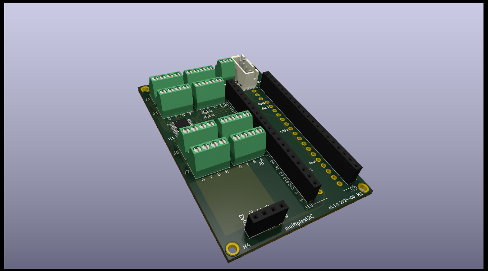
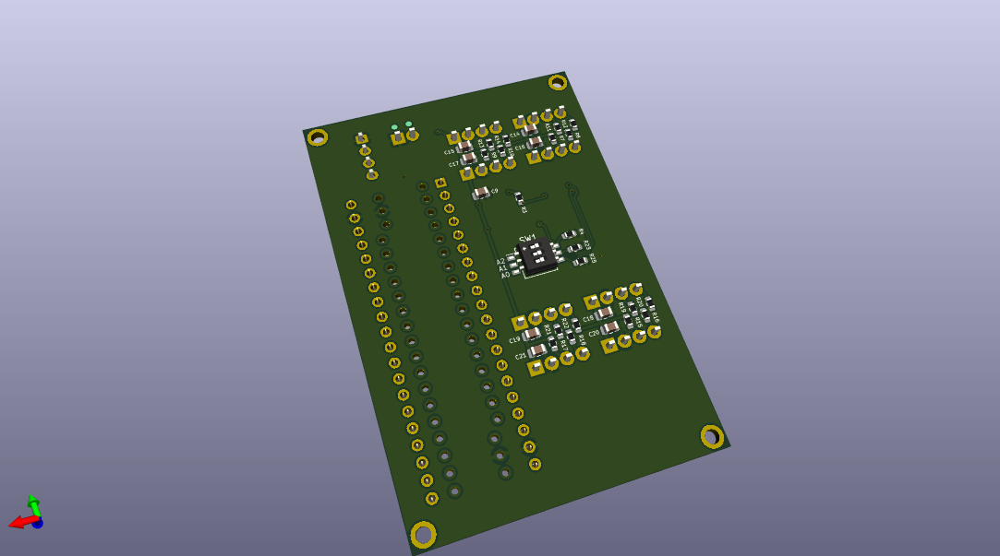

# multiplexI2C
Multiplexed 4-wire screw down connectors on I2C with PCA9548A

##  Contents

See the auto-generated menu in the github README display (above right).

## Summary

Kicad project WIP.

( hints from https://docs.github.com/en/repositories/working-with-files/using-files/working-with-non-code-files#3d-file-viewer )

3D  .stl file  rendered by both Github and by Meshlab. So far only mono-colour working. 
To render by Meshlab may require cloning the whole repository to get the single file.
(At least, I have not found how to download a single file that Github wants to render.)

3D  .atl file  rendered by Github? (very big file) but not by Meshlab. So far only mono-colour. 
There seems to be no advantage over a .stl file.

3D  .wrl file (opens with eg. Meshlab) but may need file download and then view. Good, full colour. 
Not rendered by github.

