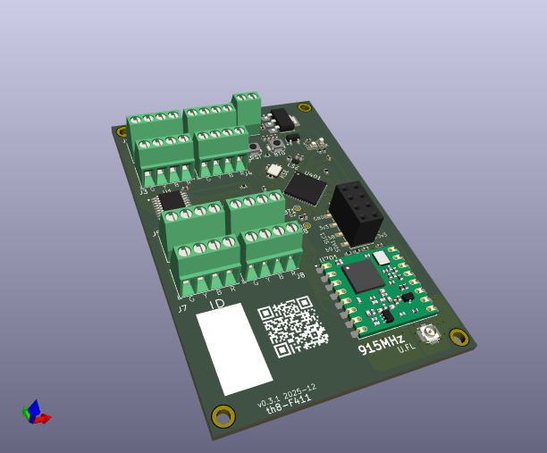
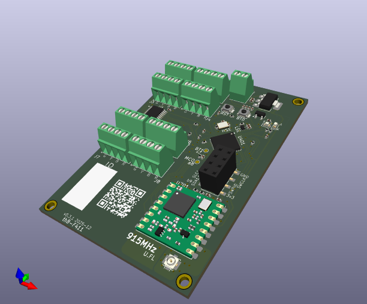
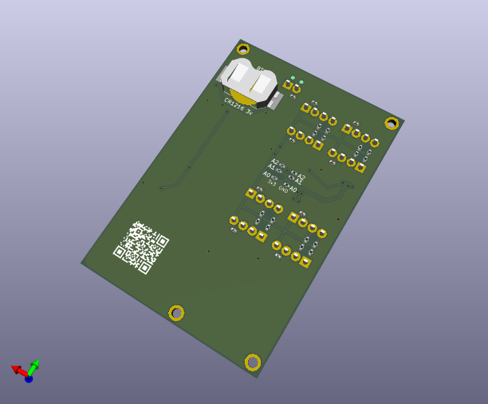

# multiplexI2C
Multiplexed 4-wire screw down connectors on multiplexed on I2C with PCA9548A. 
This allows connecting I2C sensors such as AHT10 (on module boards) using 
low voltage 4-wire cable.

##  Status: Prototype.

## Summary

Kicad project WIP.

PCB design to connect multiple (up to 8) I2C sensors (eg. AHT20) to a I2C multiplexer
connecting to an MCU. Sensor connectors are  4-pin KF128-2.54-4P generic screw terminals.
Many types of I2C sensors are inexpensive and easily available, 
but 4-wire cable will typically need to be attached. 

The module has a LoRa radio on a SPI bus which transmits measurement results.
There is also a I2C header for an optional OLED display, intended mainly for debugging.

Related software is in repository https://github.com/pdgilbert/SensorProject_th8.

The repository has three main branches, possibly more coming. (Branch `main` is not 
a main branch but rather a somewhat stable version of the most active
development, which is on the `dev` branch. It may be removed in the future.)
 
Branch `blackpill-socket` has two 20-pin sockets arranged for a commonly available 
blackpill module. It has an RFM95 LoRa radio on spi, an I2C pinsocket arrange to plug in 
an SSD module for display, and 8 4-pin terminals multiplexed to connect I2C devices.
The pinsocket arrangement can also be used for jumper-wiring MCUs on other development
boards. As of November 2025, further work on this branch will be limited.
 
Branch `f411-RFM95W-module` has a footprint for a module with an MCU and LoRa radio.
(See repository MCU-LoRa for module details.)
It has an I2C socket arrange to plug in an SSD module for display, 
and 8 4-pin terminals multiplexed to connect I2C devices. 
As of November 2025 this branch is almost ready to manufacture a prototype.
 
Branch `f411-RFM95W` has an STM32F411 MCU and RFM95W LoRa radio on the board (no module).
It has an I2C socket arrange to plug in an SSD module for display, 
and 8 4-pin terminals multiplexed to connect I2C devices. 
As of November 2025 this branch is in progress.

See history further below for regarding status and testing of each branch.

The `.png` files are produced from kicad  in the `3D Viewer`  with `File > Export Current View as PNG`.

( hints from https://docs.github.com/en/repositories/working-with-files/using-files/working-with-non-code-files#3d-file-viewer )

3D  `.wrl` file opens with Meshlab. Good, full colour. The file needs to be download and then viewed. 
To download go to the file in the Graphics/ directory and click on the file.
Github will try to render this, but fails because it is too large.
Then click on the download raw file icon at the top right. 
The file is produced from kicad  with `File > Export ... >  VRML...`

3D  `.step` file can be loaded by Freecad. It can be downloaded as above for `.wrl`.
The file is produced from kicad  with `File > Export ... >  STEP...`

3D  `.stl` file can be  rendered by Github, Meshlab and Freecad. So far only mono-colour is working. 
To render by Meshlab or Freecad requires downloading as above for `.wrl`.
The file can be produced from kicad by exporting a `.wrl` or `.step` file, 
importing that to Meshlab or Freecad, and then exporting to `.stl`

3D  `.ast` file (ASCII stl) is rendered by Github, according to above link, but files  
larger than 10 MB are too big for GitHub to display. 
The `multiplexI2C.ast` is almost 20MB so this format cannot be used by Github.
It is not rendered by Meshlab.

## History

 - Version 0.1.1 2025-01 (`blackpill-socket`) has pull up resistor added but 
   has not been manufactured/tested.

 - Version 0.1.0 2024-09 (`blackpill-socket`) needs manual addition of a pull up 
   resistor on nss line to the radio chip, MCU pin A4. 
   With this modification it works with `blackpill` `stm32f401` or `stm32f411` inserted,
   using AHT20 sensors. With jumper wiring it has also been used to test a WeAct 
   Studio STM32474G474 board. See notes re testing in the software repository.
