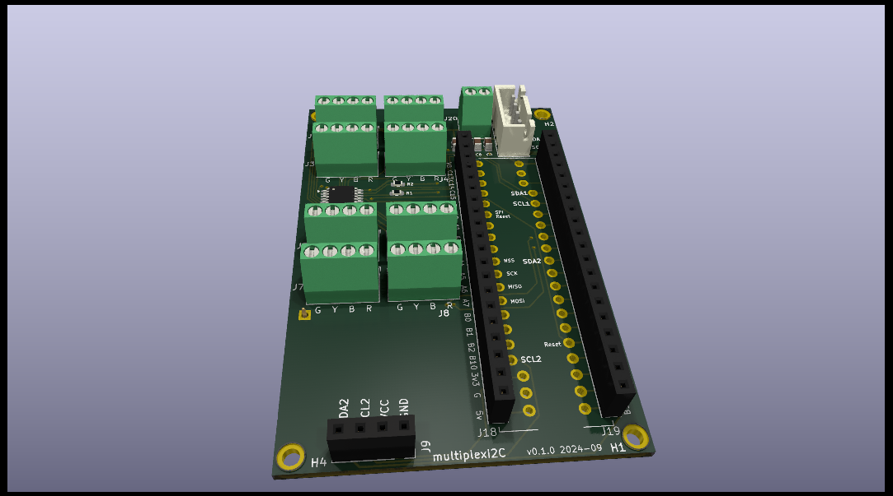

# multiplexI2C
Multiplexed 4-wire screw down connectors on I2C with PCA9548A

##  Contents

See the auto-generated menu in the github README display (above right).

## Summary

Kicad project WIP.

( hints from https://docs.github.com/en/repositories/working-with-files/using-files/working-with-non-code-files#3d-file-viewer )

3D  stl file  rendered by github

3D  atl file  rendered by github (big file)

3D  wrl file (opens with eg. Meshlab)

