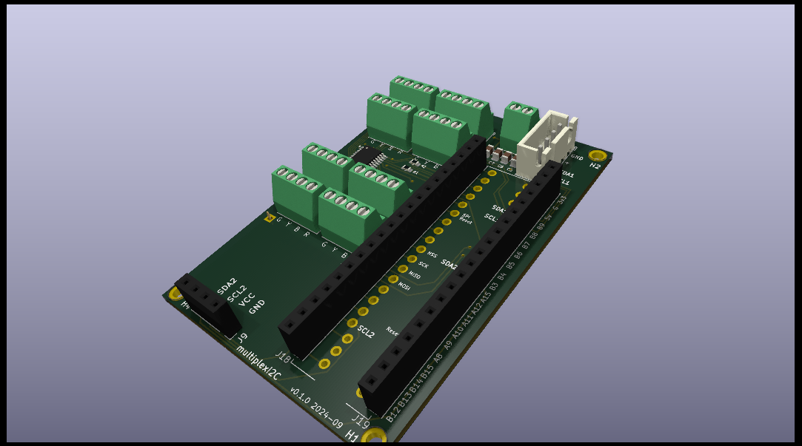
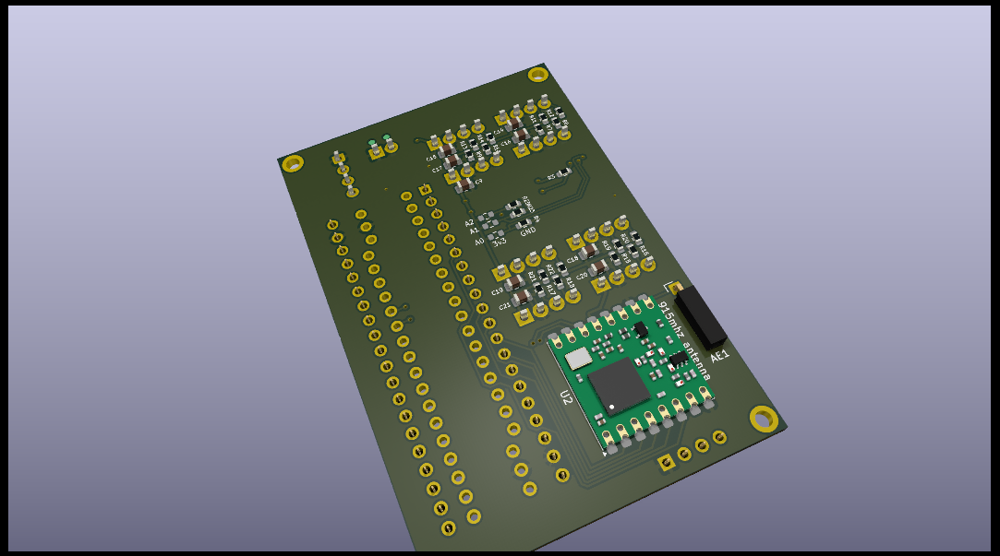

# multiplexI2C
Multiplexed 4-wire screw down connectors on I2C with PCA9548A

##  Contents

See the auto-generated menu in the github README display (above right).

## Summary

Kicad project WIP.

The `.png` files are produced from kicad  in the `3D Viewer`  with `File > Export Current View as PNG`.

( hints from https://docs.github.com/en/repositories/working-with-files/using-files/working-with-non-code-files#3d-file-viewer )

3D  `.wrl` file (opens with Meshlab) but may need file download and then view. Good, full colour. 
Not rendered by github. (The file can be downloaded. Github does not try to render it.)
The file is produced from kicad  with `File > Export ... >  VRML...`

3D  `.step` file can be loaded by Freecad. 
The file is produced from kicad  with `File > Export ... >  STEP...`

3D  `.stl` file  rendered by Github, Meshlab and Freecad. So far only mono-colour is working. 
To render by Meshlab or Freecad may require cloning the whole repository to get the single file.
(At least, I have not found how to download a single file that Github wants to render.)
The file can be produced from kicad by exporting a `.wrl` or `.step` file, 
importing that to Meshlab or Freecad, and then exporting to `.stl`

3D  `.ast` file (ASCII stl) rendered by Github, according to above link, but files  
larger than 10 MB are too big for GitHub to display. 
The `multiplexI2C.ast` is almost 20MB so this format is cannot be used by Github.
It is not rendered by Meshlab.

